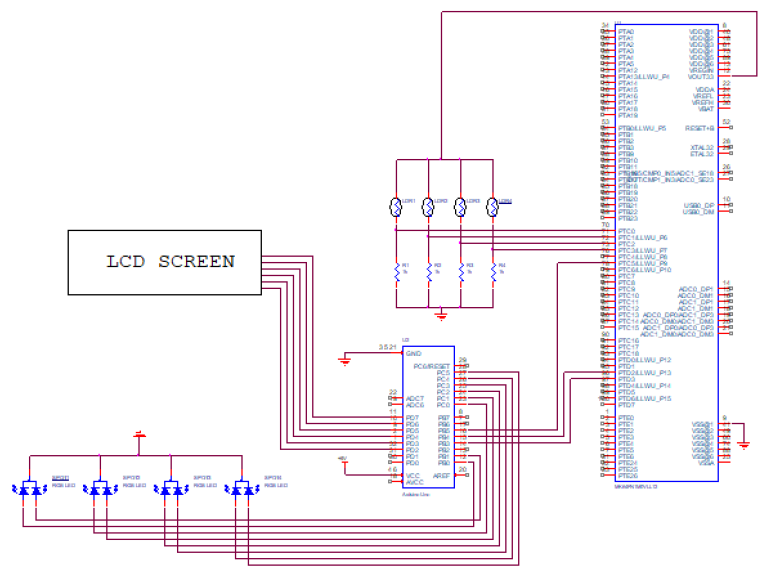
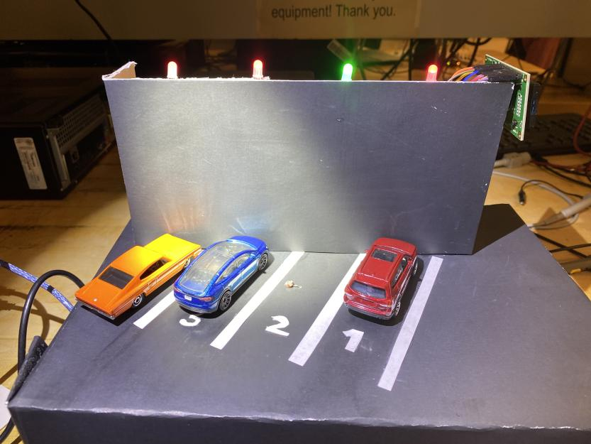
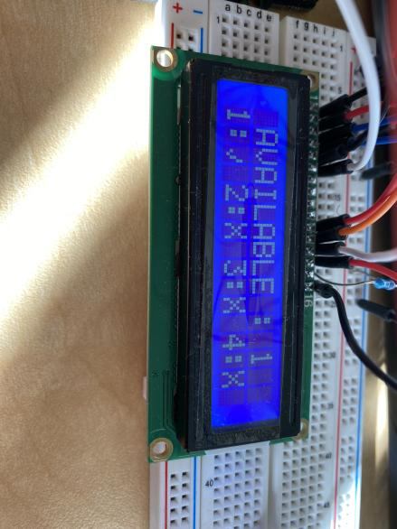
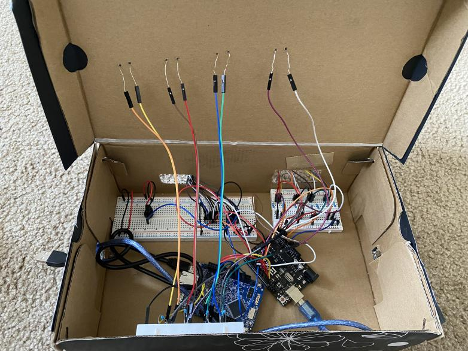
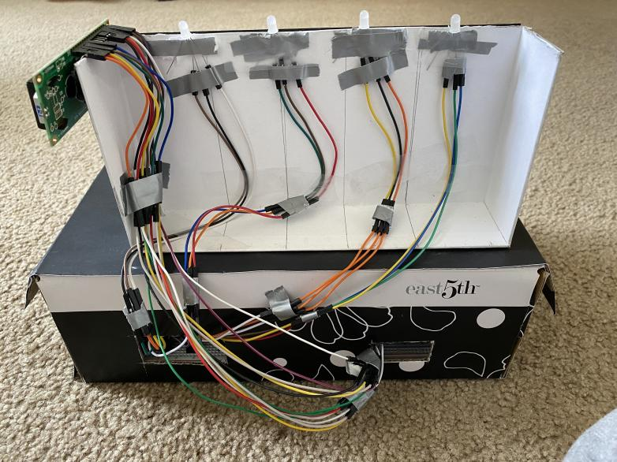

# Parking Garage

## Project Description
This project is a small scale Parking Space Monitoring System similar to one that may be found in a parking garage. It utilizes light sensors in each parking space to detect whether a parking space is occupied. Each parking space has an LED that will display Red (Occupied) or Green (Available). Additionally, there is a screen that displays the status of all parking spaces as well as a count of available spaces. This system utilizes serial communication, GPIO, and interrupts to operate as intended.

## Materials
- FRDM K64F 
- Arduino Uno
- LCD Screen
- 4 RGB LEDs
- 4 Photoresistors
- 1k ohm resistors
- wires 

## Schematic 

## Implementation

